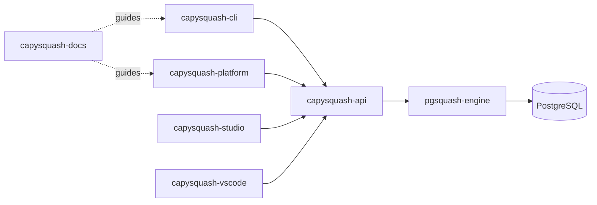

  

  # CAPYSQUASH

  **AI-native workflow acceleration for SQL + code changes**

  
  
  
  
  

---

## Overview

CapySquash helps teams **ship database and app changes with confidence**.

We build an integrated ecosystem where CLI, API, engine, platform, and docs stay aligned—so you can move from planning to validation to rollout without context switching or fragile handoffs.

## What CapySquash gives you

<table>
<tr>
<td width="50%">

### Safer SQL delivery
- Environment-aware validation
- Migration risk checks before rollout
- Reviewable change workflows
- Operational guardrails and rollback thinking

</td>
<td width="50%">

### Faster developer flow
- One system across local + CI + production
- CLI, API, UI, and editor entrypoints
- Shared engine logic across products
- Documentation that maps to real workflows

</td>
</tr>
</table>

## Ecosystem map

### Core platform components

| Repository | Role |
|---|---|
| [`pgsquash-engine`](https://github.com/CAPYSQUASH/pgsquash-engine) | Core SQL/change intelligence engine used across products |
| [`capysquash-api`](https://github.com/CAPYSQUASH/capysquash-api) | Backend service exposing engine-backed operations |
| [`capysquash-cli`](https://github.com/CAPYSQUASH/capysquash-cli) | Local developer workflow entrypoint |
| [`capysquash-platform`](https://github.com/CAPYSQUASH/capysquash-platform) | Web app for orchestration, visibility, and team workflows |

### Developer surfaces

| Repository | Role |
|---|---|
| [`capysquash-studio`](https://github.com/CAPYSQUASH/capysquash-studio) | Web UI for management and operational workflows |
| [`capysquash-vscode`](https://github.com/CAPYSQUASH/capysquash-vscode) | VS Code extension for in-editor workflows |
| [`capysquash-docs`](https://github.com/CAPYSQUASH/capysquash-docs) | Product + technical documentation hub |
| [`homebrew-tap`](https://github.com/CAPYSQUASH/homebrew-tap) | Homebrew distribution for CLI installation |

### Adjacent initiatives

| Repository | Role |
|---|---|
| [`capydb`](https://github.com/CAPYSQUASH/capydb) | Framework-native Postgres initiative adjacent to the CapySquash ecosystem |

## How the system connects

## Start here

<table>
<tr>
<td align="center" width="33%">
<strong>Install & run locally</strong> 
Start with <a href="https://github.com/CAPYSQUASH/capysquash-cli/blob/main/GETTING_STARTED.md"><code>capysquash-cli/GETTING_STARTED.md</code></a>
</td>
<td align="center" width="33%">
<strong>Explore the web platform</strong> 
Read <a href="https://github.com/CAPYSQUASH/capysquash-platform/blob/main/README.md"><code>capysquash-platform/README.md</code></a>
</td>
<td align="center" width="33%">
<strong>Dive into docs</strong> 
Browse <a href="https://github.com/CAPYSQUASH/capysquash-docs"><code>capysquash-docs</code></a>
</td>
</tr>
</table>

## Contributing

We welcome issues and pull requests across the ecosystem.

- Contribution guide: [`capysquash-cli/CONTRIBUTING.md`](https://github.com/CAPYSQUASH/capysquash-cli/blob/main/CONTRIBUTING.md)
- Security policy: [`capysquash-cli/SECURITY.md`](https://github.com/CAPYSQUASH/capysquash-cli/blob/main/SECURITY.md)

---

  Built by the CapySquash team 🟧

